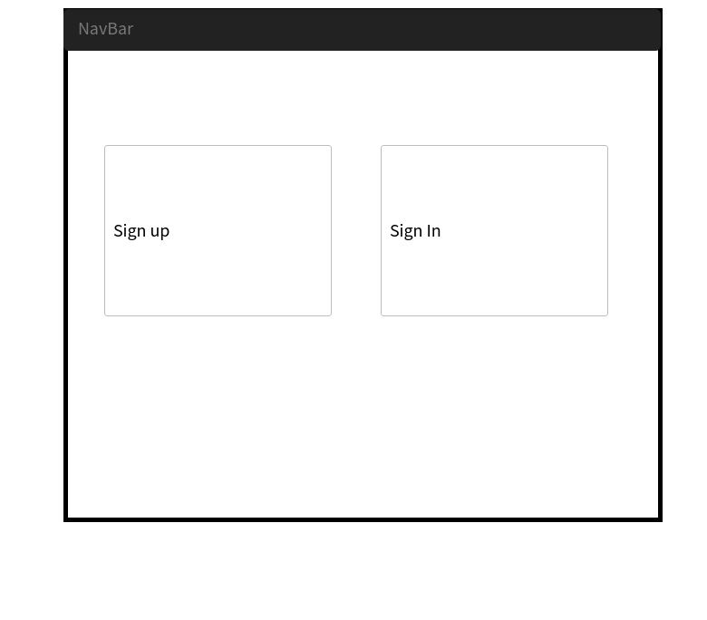
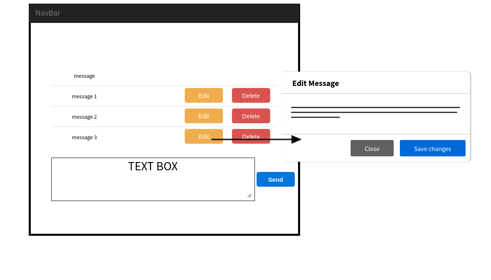

# Chatroom App - Front-end Client

## App Summary
This application is an instant messaging platform. After the user signs up and signs in, they are provided with a chatbox where they can see the history of the chat and participate in the conversation live. They can update and delete their own messages, create new ones, see all messages, and instantly receive messages from other clients.

***Message actions currently supported:***
- Refresh messages
- Send (create) messages
- Edit your messages
- Delete your messages

## Links
**Deployed front-end client:** https://sei-04-team-3.github.io/group-project-client/

**Front-end client repository:** https://github.com/sei-04-team-3/group-project-client

**Deployed back-end API:** https://floating-lowlands-13889.herokuapp.com

**Back-end API repository:** https://github.com/sei-04-team-3/group-project-api

## Technologies
HTML5, CSS3, SASS, Bootstrap

JavaScript, jQuery, Handlebars.js

NodeJS

## Development documentation

### Wireframes && User stories

Wireframes

User stories

- As an unregistered user, I would like to sign up with email and password.
- As a registered user, I would like to sign in with email and password.
- As a signed in user, I would like to change password.
- As a signed in user, I would like to sign out.
- As a signed in user, I would like to join a chat room.
- As a signed in user in a room, I would like to see all messages in the chat room.
- As a signed in user in a room, I would like to send my own messages to the chat room.
- As a signed in user in a room, I would like to update my own messages to the chat room.
- As a signed in user in a room, I would like to delete my own messages to the chat room.

### Client - Front-end
##### Setup and intialize to local/remote and Git Pages
Install dependencies and work with locally with Grunt
- Use `npm` to install dependencies
- Use `grunt` to deploy to Git Pages

##### Project planning
Divide team members into different roles

Product Lead: Moises Herrera || Front-End Lead: David Tersoff || Back-End Lead: Marc Pelve || Quality Assurance: Kimberly Wilkes

1. Brainstorm
2. Wrote User Stories and WireFrames
3. Assign Roles
4. Divide into two primary teams:
  - Back-End Functionality and Front-End Connecting with Back-End/AJAX/Other Software/Socket.io - Marc Pelve & Moises Herrera
  - Front End Aesthetic and Design, Handlebars, Keeping Code Clean, Styling, Proving Back-End with necessary features, overall User Experience.
5. Team Began with the Back-End
  - Front-End Team Tackled creating Models for Messages
  - Back-End Team Tackled creating routes and adding to server.js.
6. Create Authentication features
  - Back-End handled making AJAX requests, events and User Interface messages.
  - Front-End Team handled creating all html files, styling utilizing bootstrap and handlebars. They led with creating html/css features and then Back-End utilized those features to create actions through connecting with database.
7. Create Messages and chatbox
  - Front-End Team, Produced functional and reproducable handlebars html code for each client that visits the site. Kimberly in charge of styling buttons, spacing, and aesthetic design of chatbar. David in charge of creating unique feature such as displaying message-user ownership, timestamped the messages, and scrolling features. Also helped Back-End with CRUD actions and overall chatbox logic. Kimberly assigned to check all code before anyone submit a push request.
  - Back-End Team in charge of CRUD actions on messages. Marc produced the Create feature. Moises produced Delete, Update, and Index with help front Front-End Team. Marc also in charge of implementing socket.io functionality for instantaneous communication with all clients on the site. In charge, of conencting socket.io with front end and dealt with the logic of how each client will receive users from all other clients.

##### Structure planning - Linking to API
Link to API resource and use for protected transactions
- `User` resource requests for authentication
- `Message` resource to be used as transactions listing
  - Protected resource will require authorization token

  `Users` -|--< `Messages`

  **User** has many **Messages**

  <table style="display:inline">
  <th colspan="2" style="text-align:center">Messages</th>
  <th colspan="2" style="text-align:center">User</th>
  <tr>
  <td>_id</td>
  <td>MongoDB generated</td>
  <td>_id</td>
  <td>MongoDB generated</td>
  </tr>
  <tr>
  <td>text</td>
  <td>string</td>
  <td>email</td>
  <td>string</td>
  </tr>
  <tr>
  <td>owner</td>
  <td>ref to user</td>
  <td>hashedPassword</td>
  <td>string</td>
  </tr>
  <tr>
  <td></td>
  <td></td>
  <td>token</td>
  <td>string</td>
  </tr>
  <tr>
  <td></td>
  <td></td>
  <td>role</td>
  <td>string: default 'member'</td>
  </tr>
  <tr>
  <td>timestamps</td>
  <td>datetime</td>
  <td>timestamps</td>
  <td>datetime</td>
  </tr>
  </table>

##### Data Display
Use handlebars and jQuery to dynamically display data

##### End Point Testing
Postman requests to test early in development

<ul style="list-style-type:none;">
  <li>get -> #index, #show<li>
  <li>post -> #create</li>
  <li>patch -> #update</li>
  <li>delete -> #destroy</li>
</ul>

### Project problem realizations
Due to the application being a small project it was going to be limited to few files and limited funcitonality. This would mean most of the time would be spent working on the front-end as a team and thus requiring to work in files that reference each other a lot. Creating a work flow to ensure that everyone could write the piece of functionality they were tasked to write whilst referencing the same file was tricky. We even came across a pretty substantial problem where we ended up dropping the branch entirely. Luckily there wasn't much work on it and any of it could have just been copied over, but it definitely taught us a great deal of why good work flow and source control is important for projects like theses.

#### Potential updates
1. Allow the user to create mutliple chatrooms
2. Show a list of online users, not only the users who belong to the chatroom
3. Allow users to send private messages to each other
4. Implement themes for the UI to give customization to the user
